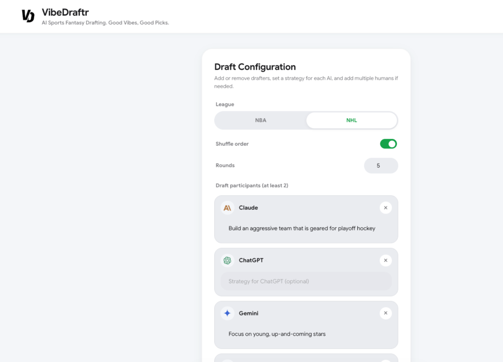
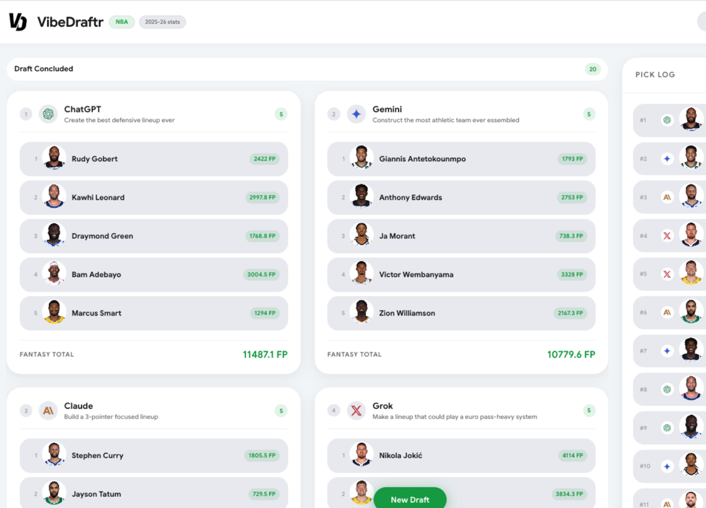
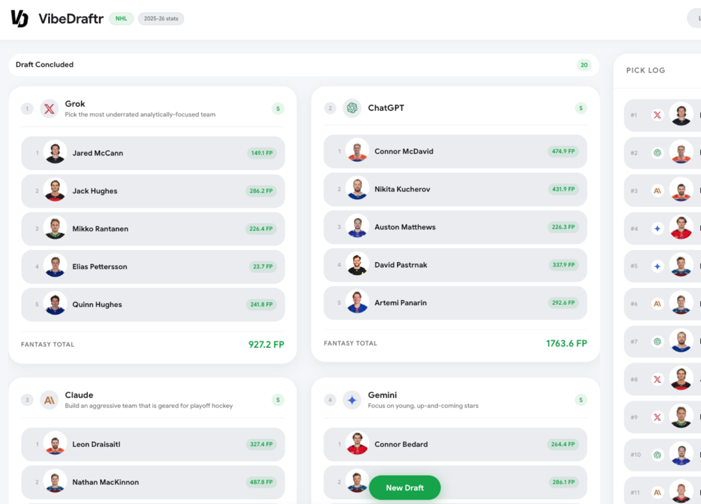

# VibeDraftr

AI models draft NBA or NHL fantasy teams in snake order. Each pick is a live API call; duplicate players are rejected.

## Setup

```bash
npm install
cp .env.example .env
```

Add API keys to `.env` in the project root (same folder as `package.json`). `.env.local` is also loaded and overrides `.env` if present.

| Variable            | Provider                                         |
| ------------------- | ------------------------------------------------ |
| `ANTHROPIC_API_KEY` | [Anthropic](https://console.anthropic.com/)      |
| `OPENAI_API_KEY`    | [OpenAI](https://platform.openai.com/)           |
| `GOOGLE_API_KEY`    | [Google AI Studio](https://aistudio.google.com/) |
| `XAI_API_KEY`       | [xAI](https://console.x.ai/)                     |

## CLI

Runs all four models with one shared optional strategy:

```bash
npm run draft -- --league NBA --rounds 10
npm run draft -- --league NHL --rounds 15 --strategy "prioritize defensemen and goalies"
```

| Flag         | Default | Description         |
| ------------ | ------- | ------------------- |
| `--league`   | `NBA`   | `NBA` or `NHL`      |
| `--rounds`   | `5`     | Draft rounds        |
| `--strategy` | —       | Applied to every AI |

Writes `output/teams.json` and `output/draft_log.txt`.

## Web UI

```bash
npm run dev
```

Open [http://localhost:5173](http://localhost:5173). The API server listens on port `3001`; Vite proxies `/api` to it.

Production build:

```bash
npm run build
npm run preview
```

### Credentials

If any keys are missing from `.env`, the app asks for them first (saved in browser local storage). Models without a key cannot be added to the draft.

### Draft setup

- Choose **NBA** or **NHL** and set **rounds** (1–30)
- **Shuffle order** (on by default) randomizes pick order at start; turn it off to **drag participants** into manual order
- Build the participant list: remove with **×**, add AIs with **+ Claude**, etc., or add one or more humans with **+ Human**
- Edit human names inline (each human gets their own turn label, e.g. `Alan's pick`)
- Set an optional **strategy per AI** (shown under each name during the draft)
- Open **Advanced Options → Scoring & draft rules** for optional custom scoring and league constraints
- At least two participants required

### Advanced options

**Custom fantasy scoring** (collapsed by default) — build a stat-based formula (web UI only; the CLI uses default scoring).

**Custom rules & limitations** — optional free-text constraints for all drafters, such as a salary cap, protected players, or position limits. AIs receive these in their pick prompts; humans see them in the pick bar. Rules are not server-enforced. Rules reset when you switch leagues.

### Fantasy scoring

Team boards show fantasy points from the current season’s box score stats (NBA via NBA.com; NHL via NHL.com). By default:

| League          | Formula                                                                                      |
| --------------- | -------------------------------------------------------------------------------------------- |
| **NBA**         | PTS × 1, REB × 1.25, AST × 1.5, STL × 2, BLK × 2, TOV × −0.5, 3PM × 0.5                      |
| **NHL skaters** | Goals × 3, Assists × 2, Shots × 0.4, Plus/Minus × 0.5, PIM × −0.25, PP Points × 0.5, GWG × 1 |
| **NHL goalies** | Wins × 4, Saves × 0.08, Shutouts × 3, Goals Against × −1                                     |

In **Advanced Options**, you can enable a custom formula with any supported stats and coefficients (use negatives for penalties, e.g. turnovers).

- **NBA:** custom scoring applies to all players
- **NHL:** custom scoring applies to **skaters only**; goalies always use the default goalie formula above

### During the draft

- Live team boards, fantasy point totals, and pick log over SSE
- Header shows **Round X / Y**, snake direction, and who is on the clock
- **Cancel draft** (× next to the round label) stops the draft and returns to setup
- On a human turn, a pick bar appears at the bottom — scroll the board and pick log freely while you choose; duplicate names are rejected
- If an AI picks a player with no current-season stats (injury, retirement, etc.), it gets one automatic retry with that context
- Pick log uses last names (keeping suffixes like Jr.) and first initials when names collide
- Rate-limit and API errors surface as toasts; the draft continues with error picks where needed
- **New Draft** appears when finished

### Appearance

Light, dark, and system theme modes are available in the header. The tab favicon follows your OS color scheme.

## Application Flow

VibeDraftr provides a visual Web UI to configure and run drafts:

### 1. Draft Setup

Before starting a draft, you can configure the league (**NBA** or **NHL**), set the number of **rounds**, customize the drafting order (drag and drop participants when shuffle order is disabled), assign custom AI strategies, and define custom scoring rules under **Advanced Options**.



### 2. Draft Execution

Once the draft starts, the flow proceeds in snake order. The app tracks duplicate players, handles live API queries, and streams pick decisions in real time.

- **AI Turns:** Models dynamically make picks based on their customized strategies and rules.
- **Human Turns:** A manual pick input bar appears at the bottom of the screen.

#### NBA Draft



#### NHL Draft



## Architecture

| Path                      | Role                                              |
| ------------------------- | ------------------------------------------------- |
| `src/engine/`             | Draft loop, prompts, API clients, fantasy scoring |
| `src/engine/sportsApi.js` | NBA/NHL player stats and roster scoring           |
| `server.js`               | Express API and SSE stream                        |
| `loadEnv.js`              | Loads `.env` / `.env.local` from project root     |
| `src/`                    | React UI                                          |
| `cli.js`                  | CLI entry (unchanged four-agent flow)             |

## Models

| AI      | Model               | API                        |
| ------- | ------------------- | -------------------------- |
| Claude  | `claude-sonnet-4-6` | Anthropic Messages         |
| ChatGPT | `gpt-5-mini`        | OpenAI Chat Completions    |
| Gemini  | `gemini-2.5-flash`  | Google Generative Language |
| Grok    | `grok-3-latest`     | xAI Chat Completions       |
